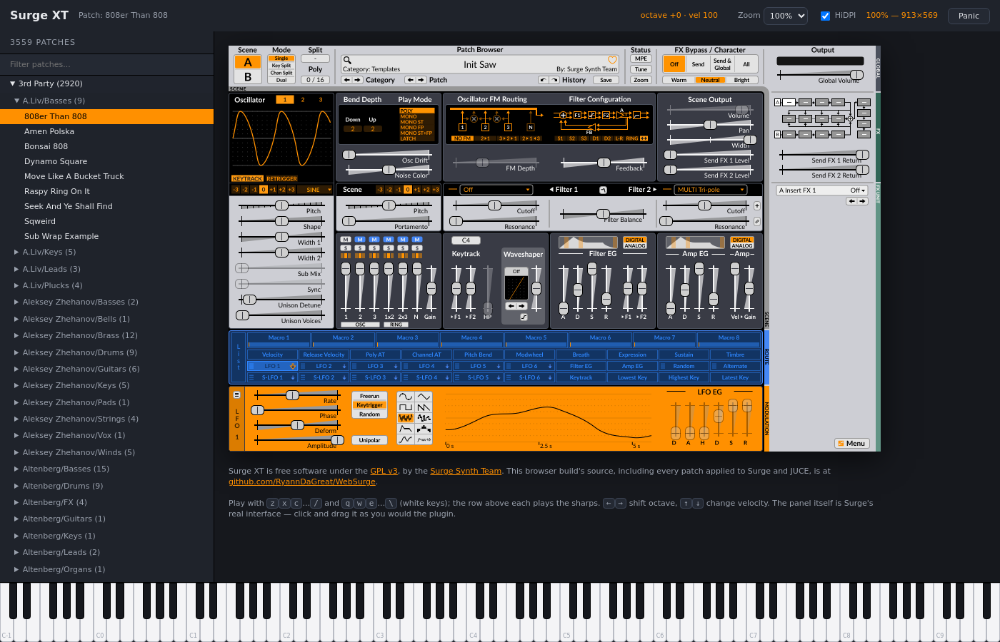

# WebSurge

[Surge XT](https://surge-synthesizer.github.io/) — the real synthesizer, the real
interface — compiled to WebAssembly and running in a browser tab. No install, no
plugin host, no account.

### ▶ **[ryanndagreat.github.io/WebSurge](https://ryanndagreat.github.io/WebSurge/)**

[](https://ryanndagreat.github.io/WebSurge/)

## What it is

Surge XT's own C++ engine and its own JUCE interface, built for
`wasm32-unknown-emscripten` and drawn to a `<canvas>`. The panel in the
screenshot is not a re-creation — it is Surge's actual editor, rendered by
Surge's own code, reading Surge's own classic skin.

- **3559 patches** — the complete library, factory and 3rd-party alike
- **203 wavetables**
- **Play from the computer keyboard** — `zxcvbnm,./` and `qwertyuiop[]\` are the
  white keys, the row above each plays the sharps
- **A 128-key piano** across the bottom that lights up as you play, and is
  playable itself
- **Resizable, HiDPI-aware** — the panel renders at your display's real pixel density

Audio runs in an `AudioWorklet`, so the synthesis happens off the main thread and
keeps going while the interface redraws.

## Running it locally

```sh
./setup.sh        # emsdk 6.0.0, Surge sources, vendor patches
./build.sh        # the audio engine
./build_gui.sh    # the interface
./run_server.sh   # serves src/ over HTTPS and prints the LAN address
```

HTTPS is the default because `AudioWorklet` requires a secure context — over
plain HTTP on a LAN address, `audioWorklet` is simply `undefined` and there is no
sound.

## Thanks

To the **[Surge Synth Team](https://surge-synthesizer.github.io/)** and everyone
who has contributed to Surge XT. Surge is a genuinely extraordinary piece of free
software — decades of DSP work, given away, and written clearly enough that it
could be lifted onto an entirely unintended platform. None of this is my
achievement; it is theirs, moved sideways.

And to the **3rd-party patch authors** whose banks ship with Surge, all of whom
are here:

> Aleksey Zhehanov · A.Liv · Altenberg · Argitoth · Black-Sided Sun · Bluelight ·
> Cybersoda · Damon Armani · Dan Maurer · Databroth · Emu · Exquis MPE ·
> Giana Brotherz · Inigo Kennedy · Jacky Ligon · John Valentine · Kinsey Dulcet ·
> Kuniklo · Kyurumi · Landosonic · LinnStrument MPE · Lopyt · Luna · Malfunction ·
> Nick Moritz · Noisegeek · Psiome · Send Sound qb · Rare Earth · Rozzer ·
> Slowboat · Stefan Singer · TNMG · Vincent Zauhar · Vospi · Xenofish · Zoozither

## License

Surge XT is **GPL-3.0**, so WebSurge is too. The complete corresponding source —
including every patch applied to Surge and to JUCE to make them build for
Emscripten — is in this repository, under `patches/`.

Patches and wavetables are redistributed under the terms Surge ships them with.
